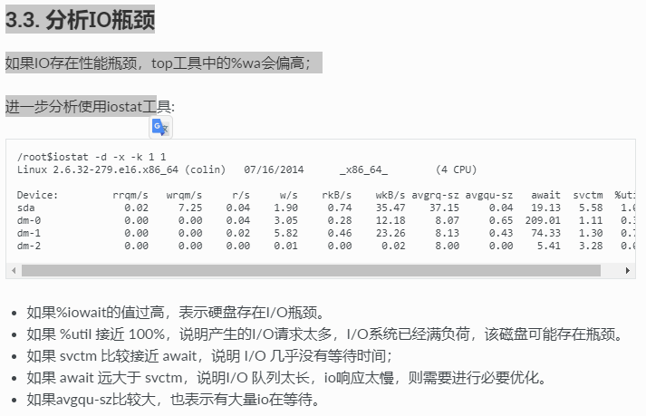

## 查询使用该端口的进程的PID
```
$lsof -i:7902
```

## 探测前往地址IP的路由路径
```
$traceroute IP
```

## 查看core文件是哪个程序生成的 
```
$file core.22355
```


## strings 查询数据中的文本信息
```
$strings <objfile>
```

## fuser 显示文件使用者
```
$fuser -m -u redis-server
```

